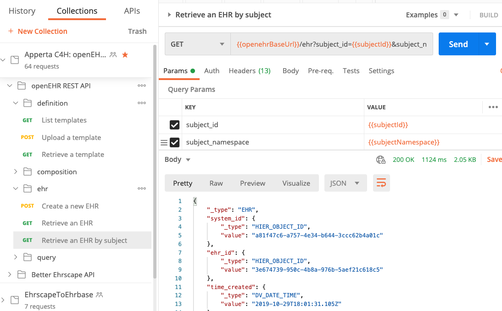

# Retrieving the patient's ehrId 

When a patient is registered with an openCDR, a '`subjectId` (normally a real-word identifier like an National identifier e.g. NHS number, CHI number in the UK) or hospital MRI) is submitted by a `POST /ehr | create EHR from SubjectId`  call.  

A top-level openEHR `EHR` object is then created in the CDR along with a unique internal `ehrId` identifier for that patient.

Most openCDR API calls require an 'ehrId' to identify the correct patient, so normally the first activity required if interacting with a patient record is to retrieve their `ehrId`, and then often to cache that identifier so it can be used for subsequent calls, until a new patient is being accessed.

### `GET /ehr - retrieve ehr from subjectId/subjectNamespace`

##### Parameters

###### `subjectId`

This is the external identifier by which the patient is known within the CDR. It is normally a real-word identifier like an NHS number, CHI number or Hospital 'MRI' number, and will have been supplied to the CDR when the patients' `EHR` object was created in the datastore.

Example value : `9999999000`

###### `subjectNamespace`

This is just a unique string used to identify the numbering scheme used for the `subjectId`. It will commonly be some sort of URI such as `{{cdr.subjectNamespace}}` and will have been agreed at national level.

Example value : `{{cdr.subjectNamespace}}`

=== "Postman"
    

=== "cURL"
    ```bash
        --curl location \
        --request GET '/ehr/?subjectId={{cdr.opencdrBaseUrl}}9999999000&subjectNamespace=uk.nhs.nhs_number' \
        --header 'Content-Type: application/json' \
        --header 'Accept: application/json' \
        --header 'Authorization: {{cdr.authToken}}'
        --header 'PREFER: return=minimal' \
    ```

=== "NodeJs - Axios"
    ```js
        var axios = require('axios');

        var config = {
        method: 'get',
        url: '{{cdr.opencdrBaseUrl}}/ehr?subject_id=9999999000&subject_namespace=uk.nhs.nhs_number',
        headers: { 
            'Accept': 'application/json', 
            'Content-Type': 'application/json', 
            'PREFER': 'return=minimal', 
            'Authorization': {{cdr.authToken}}'
        }
        };

        axios(config)
        .then(function (response) {
        console.log(JSON.stringify(response.data));
        })
        .catch(function (error) {
        console.log(error);
        });
    ```

=== "Python/requests"
    ```python
    import requests

        url = "{{cdr.opencdrBaseUrl}}/ehr?subject_id=9999999000&subject_namespace=uk.nhs.nhs_number"

        payload = {}
        headers = {
        'Accept': 'application/json',
        'Content-Type': 'application/json',
        'PREFER': 'return=minimal',
        'Authorization': '{{cdr.authToken}}'
        }

        response = requests.request("GET", url, headers=headers, data = payload)

        print(response.text.encode('utf8'))
    ```

#### Response


An openCDR will give a `200` response code and this structure. 

The `ehrId` that you need to capture is `ehr_id.value` item in the response.


!!! hint
    You may want to consider caching this for the session, so that it can be used for a number of subsequent calls.


```json
{
    "_type": "EHR",
    "system_id": {
        "_type": "HIER_OBJECT_ID",
        "value": "4cce5a07-be4d-4318-a94f-3b8401853a20"
    },
    "ehr_id": {
        "_type": "HIER_OBJECT_ID",
        "value": "5dd03bc9-4419-4981-8798-ff4dda8ee9de"
    },
    "time_created": {
        "_type": "DV_DATE_TIME",
        "value": "2020-07-21T09:00:24.977Z"
    },
    "ehr_status": {
        "_type": "EHR_STATUS",
        "uid": {
            "_type": "HIER_OBJECT_ID",
            "value": "09bcd903-1565-44db-9087-2ff5e5bc7194::4cce5a07-be4d-4318-a94f-3b8401853a20::1"
        },
        "subject": {
            "_type": "PARTY_SELF",
            "external_ref": {
                "_type": "PARTY_REF",
                "id": {
                    "_type": "HIER_OBJECT_ID",
                    "value": "9999999000"
                },
                "namespace": "uk.nhs.nhs_number"
            }
        },
        "is_queryable": true,
        "is_modifiable": true
    }
}
 
```
