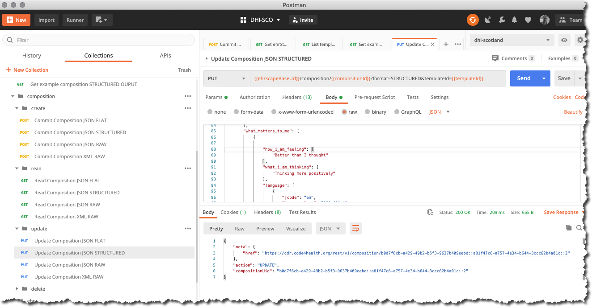

# Updating Patient Observations data

All new data committed to an openEHR CDR is done so via a `POST /composition call` - as a JSON or XML 'blob'.

Most compositions will only need to be updated if an error or omission needs to be corrected. All openEHR data is strictly audited and version controlled, so an Update operation requires a `PUT /composition call`.

You will nearly always with to first retrieve the original version of the composition via a `GET /composition` call, update the JSON or XML object and then perform the `PUT`


#### Better Ehrscape `PUT /composition - Update composition`

##### Parameters

`compositionId`: 
This is is the `composition UID` for the **previous version** of the composition i.e the version that you are about to overwrite. Don't worry about how we find this, just use the `uid` for the composition you just committed in the last section.

`format`:
This defines the format of JSON or XML that you are requesting. Use `FLAT` for this example.

`templateId`: 
This is the identifier of the openEHR template, against which you need to validate the composition, in this case, ``.

##### Request

=== "Postman"
    
=== "cURL" 
    ```bash
       curl --location \
       --request PUT 'https://cdr.code4health.org/rest/v1/composition/7b20dc2b-6494-467d-8986-469367f7c75b::4cce5a07-be4d-4318-a94f-3b8401853a20::1?format=FLAT&templateId=JMOHW%20-%20Passport%20observations.v0' \
    --header 'Content-Type: application/json' \
    --header 'Authorization: {{cdr.authToken}}' \
    --data-raw '{
           {
        "passport_observations/_uid": "7b20dc2b-6494-467d-8986-469367f7c75b::4cce5a07-be4d-4318-a94f-3b8401853a20::1",
        "passport_observations/language|code": "en",
        "passport_observations/language|terminology": "ISO_639-1",
        "passport_observations/territory|code": "JM",
        "passport_observations/territory|terminology": "ISO_3166-1",
        "passport_observations/context/start_time": "2020-10-18T16:16:21.449Z",
        "passport_observations/context/setting|code": "238",
        "passport_observations/context/setting|value": "other care",
        "passport_observations/context/setting|terminology": "openehr",
        "passport_observations/blood_pressure/systolic|magnitude": 169.0,
        "passport_observations/blood_pressure/systolic|unit": "mm[Hg]",
        "passport_observations/blood_pressure/diastolic|magnitude": 692.0,
        "passport_observations/blood_pressure/diastolic|unit": "mm[Hg]",
        "passport_observations/blood_pressure/time": "2020-10-18T16:16:21.452Z",
        "passport_observations/blood_pressure/language|code": "en",
        "passport_observations/blood_pressure/language|terminology": "ISO_639-1",
        "passport_observations/blood_pressure/encoding|code": "UTF-8",
        "passport_observations/blood_pressure/encoding|terminology": "IANA_character-sets",
        "passport_observations/height_length/height_length|magnitude": 609.33,
        "passport_observations/height_length/height_length|unit": "cm",
        "passport_observations/height_length/time": "2020-10-18T16:16:21.453Z",
        "passport_observations/height_length/language|code": "en",
        "passport_observations/height_length/language|terminology": "ISO_639-1",
        "passport_observations/height_length/encoding|code": "UTF-8",
        "passport_observations/height_length/encoding|terminology": "IANA_character-sets",
        "passport_observations/body_weight/weight|magnitude": 380.49,
        "passport_observations/body_weight/weight|unit": "kg",
        "passport_observations/body_weight/time": "2020-10-18T16:16:21.453Z",
        "passport_observations/body_weight/language|code": "en",
        "passport_observations/body_weight/language|terminology": "ISO_639-1",
        "passport_observations/body_weight/encoding|code": "UTF-8",
        "passport_observations/body_weight/encoding|terminology": "IANA_character-sets",
        "passport_observations/blood_glucose/test_name|code": "14743-9",
        "passport_observations/blood_glucose/test_name|value": "Glucose [Moles/volume] in Capillary blood by Glucometer",
        "passport_observations/blood_glucose/test_name|terminology": "LOINC",
        "passport_observations/blood_glucose/laboratory_analyte_result/analyte_name|code": "14743-9",
        "passport_observations/blood_glucose/laboratory_analyte_result/analyte_name|value": "Glucose [Moles/volume] in Capillary blood by Glucometer",
        "passport_observations/blood_glucose/laboratory_analyte_result/analyte_name|terminology": "LOINC",
        "passport_observations/blood_glucose/laboratory_analyte_result/analyte_result|magnitude": 52.61,
        "passport_observations/blood_glucose/laboratory_analyte_result/analyte_result|unit": "mmol/L",
        "passport_observations/blood_glucose/time": "2020-10-18T16:16:21.453Z",
        "passport_observations/blood_glucose/language|code": "en",
        "passport_observations/blood_glucose/language|terminology": "ISO_639-1",
        "passport_observations/blood_glucose/encoding|code": "UTF-8",
        "passport_observations/blood_glucose/encoding|terminology": "IANA_character-sets",
        "passport_observations/pulse_oximetry/spo|numerator": 0.0,
        "passport_observations/pulse_oximetry/spo|denominator": 100.0,
        "passport_observations/pulse_oximetry/spo|type": 2,
        "passport_observations/pulse_oximetry/spo": 0.0,
        "passport_observations/pulse_oximetry/time": "2020-10-18T16:16:21.455Z",
        "passport_observations/pulse_oximetry/language|code": "en",
        "passport_observations/pulse_oximetry/language|terminology": "ISO_639-1",
        "passport_observations/pulse_oximetry/encoding|code": "UTF-8",
        "passport_observations/pulse_oximetry/encoding|terminology": "IANA_character-sets",
        "passport_observations/body_temperature/temperature|magnitude": 72.7,
        "passport_observations/body_temperature/temperature|unit": "[degF]",
        "passport_observations/body_temperature/time": "2020-10-18T16:16:21.455Z",
        "passport_observations/body_temperature/language|code": "en",
        "passport_observations/body_temperature/language|terminology": "ISO_639-1",
        "passport_observations/body_temperature/encoding|code": "UTF-8",
        "passport_observations/body_temperature/encoding|terminology": "IANA_character-sets",
        "passport_observations/clinical_synopsis/notes": "Notes 9",
        "passport_observations/clinical_synopsis/language|code": "en",
        "passport_observations/clinical_synopsis/language|terminology": "ISO_639-1",
        "passport_observations/clinical_synopsis/encoding|code": "UTF-8",
        "passport_observations/clinical_synopsis/encoding|terminology": "IANA_character-sets",
        "passport_observations/category|code": "433",
        "passport_observations/category|value": "event",
        "passport_observations/category|terminology": "openehr",
        "passport_observations/composer|name": "moh-jamaica_4cce5a07-be4d-4318-a94f-3b8401853a20"
    }
    ```
=== "NodeJS/Axios"
    ```js

      var axios = require('axios');

        var config = {
        method: 'put',
        url: '{{cdr.ehrscapeBaseUrl}}/rest/v1/composition/7b20dc2b-6494-467d-8986-469367f7c75b::4cce5a07-be4d-4318-a94f-3b8401853a20::1?format=FLAT&templateId=JMOHW%20-%20Passport%20observations.v0',
        headers: { 
            'Content-Type': 'application/json', 
            'Authorization': 'Authorization: {{authToken}}', 
        }
        };

        axios(config)
        .then(function (response) {
        console.log(JSON.stringify(response.data));
        })
        .catch(function (error) {
        console.log(error);
        });

    ```
=== "Python/requests"
    ```python

     url = "{{cdr.ehrscapeBaseUrl}}/composition/7b20dc2b-6494-467d-8986-469367f7c75b::4cce5a07-be4d-4318-a94f-3b8401853a20::1?format=FLAT&templateId=JMOHW%20-%20Passport%20observations.v0"

        payload = {}
        headers = {
        'Content-Type': 'application/json',
        'Authorization: {{authToken}}',
      }'

      response = requests.request("GET", url, headers=headers, data = payload)

      print(response.text.encode('utf8'))

    ```

##### Response

```json
{
    "meta": {
        "href": "{{cdr.ehrscapeBaseUrl}}/composition/b0d7f6cb-a429-49b2-b5f3-9637b409eebd::a81f47c6-a757-4e34-b644-3ccc62b4a01c::2"
    },
    "action": "UPDATE",
    "compositionUid": "b0d7f6cb-a429-49b2-b5f3-9637b409eebd::a81f47c6-a757-4e34-b644-3ccc62b4a01c::2"
}
```

If the update is successful a `200` code will be returned.


