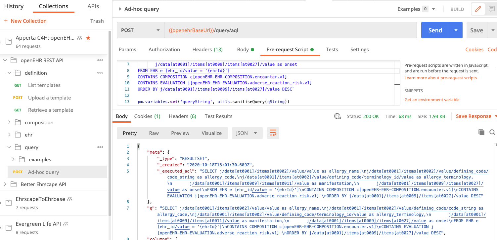

# Querying for patient medications

This section will take you through how to query for Current allergies held on the CDR, using AQL (Archetype Query Language)

The initial proposed dataset is
- the allergy name (code if available) 
- date of onset
- manifestation (the type of Reaction -rash, nausea etc)
- 

!!! important "Exact query dataset to be finalised"

    The exact dataset and/or queryString may change pending discussion with clinicians but the principles will remain identical


### Querying an openEHR CDR - Archetype Query language (AQL)

A CDR can be best thought of in terms of a exposing a complex object tree with the `EHR` object at the top, `Compositions` objects handling commits, but where **all** of the information in the tree can be traversed and accessed. Conceptually this is a logical query/graph language like SPARQL, the key difference being that the exact paths to the objects you might need to access are defined in the archetypes and templates you use to define and validate the data.

AQL can be written by hand but is normally done using a tool like the Better Studio 

Understanding AQL is not generally important for third-party developers. Normally the correct AQL will be supplied by the CDR owner, indeed in production it is much more likely that server-side stored queries would be used.

###  `POST /query` | Run an ad-hoc AQL query

This example will retrieve the data requirement above. To run the query - a `querystring` needs to be carried in the `body` of the POST call as raw data with the Header `Content-Type` set to `application/json'

This is the `queryString:` that we need to send.

```sql
SELECT SELECT c/uid/value as compositionId,
        j/data[at0001]/items[at0002]/value/value as allergy_name,
        j/data[at0001]/items[at0002]/value/defining_code/code_string as allergy_code,
        j/data[at0001]/items[at0002]/value/defining_code/terminology_id/value as allergy_terminology,
       j/data[at0001]/items[at0009]/items[at0011]/value as manifestation,
       j/data[at0001]/items[at0009]/items[at0027]/value as onset
FROM EHR e [ehr_id/value = '{{ehrId}}']
CONTAINS COMPOSITION c
CONTAINS EVALUATION j[openEHR-EHR-EVALUATION.adverse_reaction_risk.v1] 
ORDER BY j/data[at0001]/items[at0009]/items[at0027]/value DESC
```

!!! warning "Note the ehrId substitution"

You will need to make sure that the `ehrId` variable in the queryString is substituted with the correct `ehrId` for the patient concerned.

Don't worry about this seemingly odd format -it is essentially a mix of SQL and a path-based syntax, like SPARQL or XQuery.

Running the query is easy- just call the `POST /query` call, sending the AQL string in the body of the request but **note that you should strip the string of any linefeed and carriage returns** etc. 

The Postman 'Ad-hoc query' request has a utility function under 'Pre-req' that sanitises the string and sets it into an environment variable before inserting it into the request body.

=== "Postman"
    

=== "cURL"
    ```
    curl --location --request POST '{{cdr.ehrscapeBaseUrl}}/query' \
        --header 'Content-Type: application/json' \
        --header 'Authorization: {{cdr.authToken}} \
        --data-raw '{
            "aql": "{{queryString}}"
        }'
    ```
=== "NodeJs - Axios"
    ```js
      var axios = require('axios');
        var data = JSON.stringify({"aql":"{{cdr.queryString}}"});

        var config = {
            method: 'post',
            url: '{{cdr.ehrscapeBaseUrl}}/query',
            headers: { 
                'Content-Type': 'application/json', 
                'Authorization': '{{cdr.authToken}}'
            },
            data : data
         };

        axios(config)
        .then(function (response) {
        console.log(JSON.stringify(response.data));
        })
        .catch(function (error) {
        console.log(error);
        });

    ```
=== "Python/requests"
    ```python
    import requests

    url = "https://{{cdr.ehrscapeBaseUrl}}/query"

    payload = "{\n    \"aql\": \"{{queryString}}\"\n}"
    headers = {
    'Content-Type': 'application/json',
    'Authorization': '{{cdr.authToken}}'
    }

    response = requests.request("POST", url, headers=headers, data = payload)

    print(response.text.encode('utf8'))

    ```

#### Response

The AQL response comes as back as an openEHR `resultSet`, which is a tabular shape, the exact format being determined by the AQL itself.

In this example we have asked for scalar values only, but it is possible for AQL to return objects.

The `columns` object shows the openEHR paths and aliases that are are returned in each row. 

```json
{
    "meta": {
        "_type": "RESULTSET",
        "_created": "2020-10-18T15:28:31.403Z",
        "_executed_aql": "SELECT c/uid/value as compositionId,j/data[at0001]/items[at0002]/value/value as allergy_name,\nj/data[at0001]/items[at0002]/value/defining_code/code_string as allergy_code,\nj/data[at0001]/items[at0002]/value/defining_code/terminology_id/value as allergy_terminology,\n       j/data[at0001]/items[at0009]/items[at0011]/value as manifestation,\n       j/data[at0001]/items[at0009]/items[at0027]/value as onset\nFROM EHR e \nCONTAINS COMPOSITION c[openEHR-EHR-COMPOSITION.encounter.v1]\nCONTAINS EVALUATION j[openEHR-EHR-EVALUATION.adverse_reaction_risk.v1] \nORDER BY j/data[at0001]/items[at0009]/items[at0027]/value DESC"
    },
    "q": "SELECT c/uid/value as compositionId,j/data[at0001]/items[at0002]/value/value as allergy_name,\nj/data[at0001]/items[at0002]/value/defining_code/code_string as allergy_code,\nj/data[at0001]/items[at0002]/value/defining_code/terminology_id/value as allergy_terminology,\n       j/data[at0001]/items[at0009]/items[at0011]/value as manifestation,\n       j/data[at0001]/items[at0009]/items[at0027]/value as onset\nFROM EHR e \nCONTAINS COMPOSITION c[openEHR-EHR-COMPOSITION.encounter.v1]\nCONTAINS EVALUATION j[openEHR-EHR-EVALUATION.adverse_reaction_risk.v1] \nORDER BY j/data[at0001]/items[at0009]/items[at0027]/value DESC",
    "columns": [
        {
            "name": "compositionId",
            "path": "/uid/value"
        },
        {
            "name": "allergy_name",
            "path": "/data[at0001]/items[at0002]/value/value"
        },
        {
            "name": "allergy_code",
            "path": "/data[at0001]/items[at0002]/value/defining_code/code_string"
        },
        {
            "name": "allergy_terminology",
            "path": "/data[at0001]/items[at0002]/value/defining_code/terminology_id/value"
        },
        {
            "name": "manifestation",
            "path": "/data[at0001]/items[at0009]/items[at0011]/value"
        },
        {
            "name": "onset",
            "path": "/data[at0001]/items[at0009]/items[at0027]/value"
        }
    ],
    "rows": [
        [
            "b960a98f-f799-4f98-b8f1-a3e86e33035e::4cce5a07-be4d-4318-a94f-3b8401853a20::1",
            "Peniccilin",
            null,
            null,
            null,
            null
        ],
        [
            "371c5ff7-5078-4c17-b426-92e7351028d0::4cce5a07-be4d-4318-a94f-3b8401853a20::1",
            "Tetracycline",
            null,
            null,
            null,
            null
        ],
        [
            "371c5ff7-5078-4c17-b426-92e7351028d0::4cce5a07-be4d-4318-a94f-3b8401853a20::1",
            "Erythromicin",
            null,
            null,
            null,
            null
        ]
    ]
}
```

